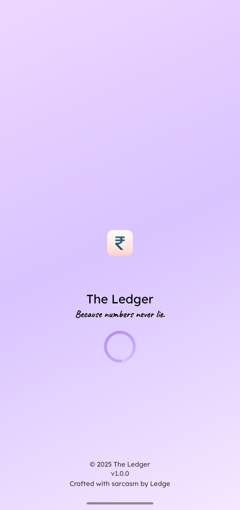
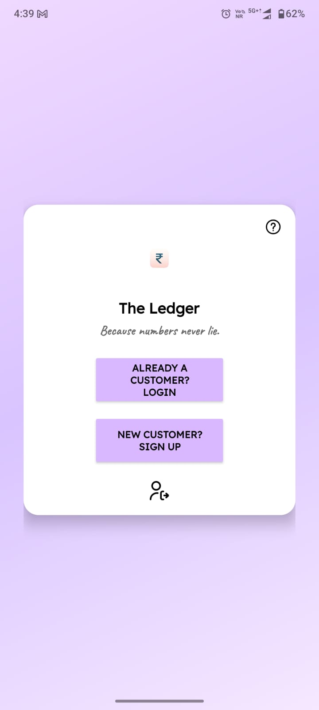
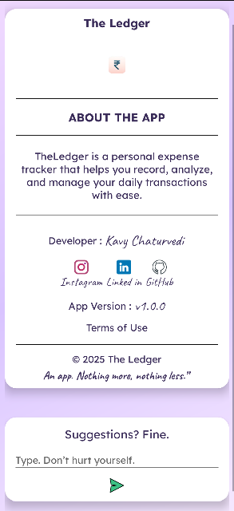
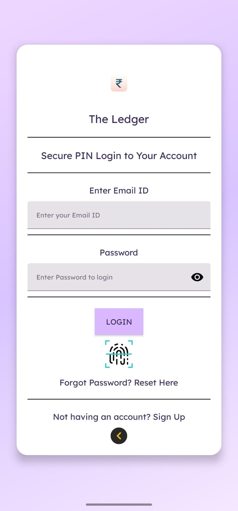
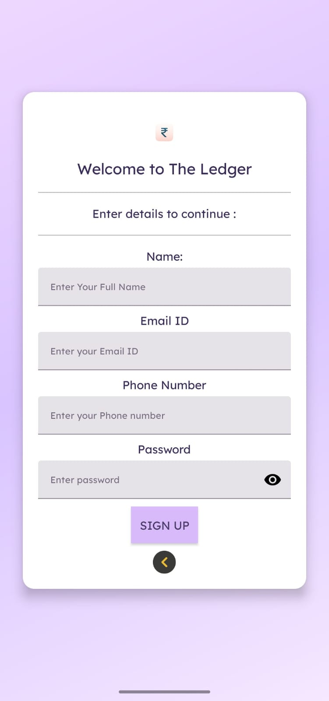
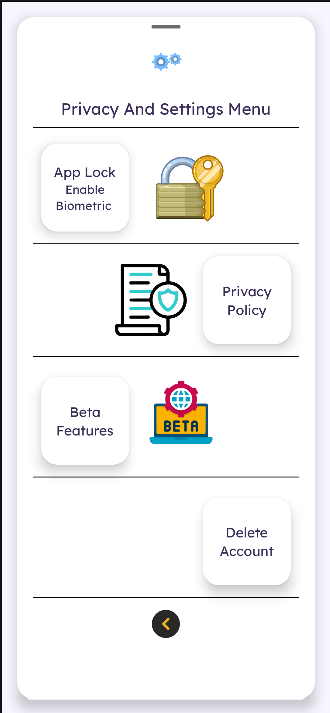
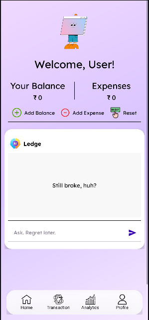
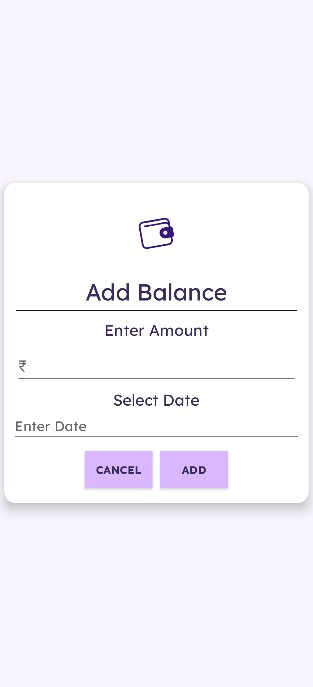
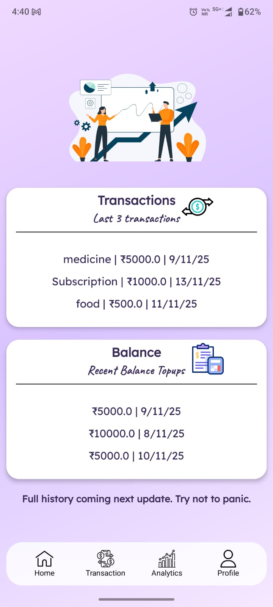
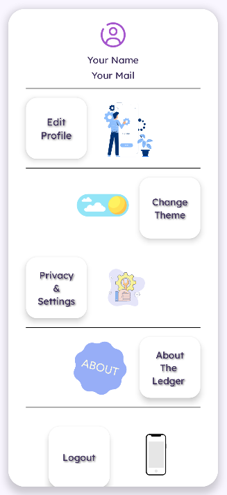

# 💰 The Ledger — Because manually typing expenses into a spreadsheet is such a 2010 thing.

**The Ledger** is a personal Android app project developed by **Kavy Chaturvedi**, designed to make expense tracking simple, secure, and intelligent. 
It combines **Firebase Authentication**, **Cloud Firestore**, and **Firebase Remote Config** to deliver a dynamic and safe financial tracking experience — all wrapped in a modern **Material Design** interface.

---

## 🧭 Overview

The Ledger helps users record and manage daily expenses effortlessly. 
It ensures **data security** with Firebase Auth and **real-time synchronization** using Firestore, while **Remote Config** enables adaptive features and experiments — paving the way for AI-powered financial insights.

---

## 🚀 Core Features

### 🔐 Secure Authentication
- Firebase **Email/Password login**
- **Biometric unlock** (Fingerprint / Face ID)
- Smart error handling and intuitive animations

### 💸 Expense Management
- Add, edit, and delete expense entries 
- Categorize transactions (Food, Bills, Travel, etc.) 
- Real-time data updates powered by **Cloud Firestore**

### 🧠 Intelligent AI Features *(Powered by Firebase Remote Config)*
- Remote feature control and dynamic app behavior 
- AI-based personalization and configuration fetched securely from Firebase 
- Allows controlled feature rollouts (e.g., beta features, recommendations)

### 📊 Expense Analysis 
- Pie chart visualization of expenses
- Category-wise breakdown for quick insights
- Monthly summaries auto-generated
- Smooth UI using MPAndroidChart / Custom Graph

### 🌙 User Interface
- Clean **Material UI** using AppCompat, CardView & ConstraintLayout 
- Smooth animations and intuitive navigation 
- Light/Dark theme ready 

---

## 🧩 Tech Stack

| Category | Technology |
|-----------|-------------|
| Language | Java / Kotlin |
| Backend | Firebase (Auth, Cloud Firestore, Remote Config) |
| UI | XML layouts + Material Components |
| Libraries | Glide, BiometricPrompt, AndroidX Components |
| IDE | Android Studio (Arctic Fox or above) |

---

---

---

## 📸 Screenshots

Here’s a quick visual walkthrough of **The Ledger** 👇  

<div align="center">

### 🧭 App Overview
<table>
<tr>
<td align="center"><b>Welcome Screen</b></td>
<td align="center"><b>Choose Login / Signup</b></td>
<td align="center"><b>About Page</b></td>
</tr>
<tr>
<td></td>
<td></td>
<td></td>
</tr>
</table>

### 🔐 Authentication Flow
<table>
<tr>
<td align="center"><b>Login Screen</b></td>
<td align="center"><b>Signup Screen</b></td>
<td align="center"><b>Privacy Policy</b></td>
</tr>
<tr>
<td></td>
<td></td>
<td></td>
</tr>
</table>

### 💸 Expense & Balance Management
<table>
<tr>
<td align="center"><b>Dashboard</b></td>
<td align="center"><b>Add Expense</b></td>
<td align="center"><b>Add Balance</b></td>
</tr>
<tr>
<td></td>
<td></td>
<td></td>
</tr>
</table>

### 🧾 Transactions & Analytics
<table>
<tr>
<td align="center"><b>Transactions</b></td>
<td align="center"><b>Analytics</b></td>
</tr>
<tr>
<td></td>
<td></td>
</tr>
</table>

### 🧾 Profile 
<table>
<tr>
<td align="center"><b>Profile</b></td>
</tr>
<tr>
<td></td>
</tr>
</table>

</div>
---


## 🛠️ Project Setup & Installation

### 1️⃣ Clone the repository
```bash
git clone [https://github.com/Kavychaturvedi5427/The-Ledger.git](https://github.com/Kavychaturvedi5427/The-Ledger.git)
cd TheLedger